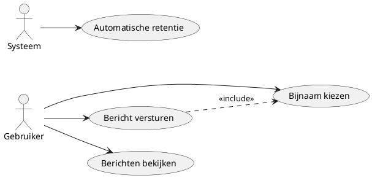

# Functioneel Ontwerp — deskchat live

**Project:** deskchat live  
**Versie:** 2.1  
**Datum:** 2025-09-09  
**Opdrachtgever:** Sven Imholz  
**Auteur:** Senne Visser  
**Website:** https://deskchat.live

---
## 1. Voorwoord
Dit document beschrijft **wat** deskchat live doet en waarom. Het systeem bestaat uit een bewegende achtergrond op de computer die live chatberichten toont, en een programma waarmee je zelf berichten kunt versturen. Het is bedoeld voor mensen die graag een sociale, interactieve achtergrond willen tijdens het werken.

---

## Inhoudsopgave
1. Voorwoord
2. Samenvatting
3. Huidige situatie  
3.1 informatie verwerking  
3.2 applicaties  
3.3 infrastructure
4. Gewenste situatie  
    4.1 Requirements (MoSCoW)  
    4.2 Informatie verwerking  
    4.3 Applicaties  
    4.4 Use-cases
5. Consequenties  
5.1 Organisatorische consequenties
5.2 technische consequenties 
6. Kosten  
7. Planning

---

## 2. Samenvatting
deskchat live is een chatprogramma dat bestaat uit twee delen:

**De achtergrond**: Een bewegende achtergrond voor je computer (gemaakt met Wallpaper Engine) waar je live berichten van andere gebruikers ziet verschijnen. Je kunt hier alleen kijken, niet typen.

**Het chatprogramma**: Een programma dat onzichtbaar op de achtergrond draait. Via een icoon onderin je scherm kun je chatberichten typen en versturen.

**Gebruiksgemak**: Geen ingewikkelde accounts aanmaken - je kiest gewoon een bijnaam en kunt meteen chatten. Berichten zijn openbaar en iedereen kan meepraten in één grote chatruimte.

**Veiligheid**: Het systeem houdt geen persoonlijke gegevens bij en beschermt tegen spam door limieten in te stellen op hoeveel berichten je kunt versturen.

---

## 3. Huidige situatie
### 3.1 informatieverwerking
Er is geen bestaand systeem met dezelfde opzet; vergelijkbare alternatieven vereisen browser of accounts.   
### 3.2 Applicaties
Geen bestaande applicaties specifiek voor deze behoefte binnen het project. Wel word er gebruik gemaakt van de Wallpaper Engine, dat bestaat al.     
### 3.3 Infrastructure
Bestaande Hostinger webhosting (PHP/MySQL) is beschikbaar.  

---

## 4. Gewenste situatie

### 4.1 Requirements (MoSCoW)
Zie 4.4 voor de use-cases tabellen.

**Must have**
- Achtergrond toont nieuwe berichten van andere gebruikers
- Gebruikers kunnen berichten typen en versturen via een tray app/widget.
- Berichten mogen niet te lang zijn, maximaal 280 tekens 
- Gebruikers kunnen een bijnaam kiezen, geen echte naam vereist.
- Systeem moderatie waaronder een filter voor scheldwoorden, rate limiting en logs

**Could have** 
- Berichten laden snel en de achtergrond gebruikt weinig computer-kracht
- Duidelijke foutmeldingen als er iets mis gaat
- Het programma stopt met werken als je computer vergrendeld is (bespaart internetverkeer)
- Informatie over privacy op de website

**Won't have, maby later**
- **Meerdere chatruimtes**: bijvoorbeeld apart voor verschillende onderwerpen
- Bestanden uploaden
- Berichten die alleen jij kunt lezen
- Moderatoren die berichten kunnen verwijderen

---
### 4.2 Informatieverwerking

    

**Een gebruiker die wil chatten doet het volgende:**
1. Installeert Wallpaper Engine en zet de deskchat live achtergrond aan
2. Downloadt tray app en start het op
3. Kiest een bijnaam (bijvoorbeeld "Alex" of "ChatLover")
4. Typt een bericht en drukt op verzenden
5. Ziet het bericht verschijnen op de achtergrond, samen met berichten van anderen

### 4.3 Applicaties

**De live achtergrond:**
- Toont alleen berichten (je kunt er niet in typen)
- Ververst automatisch elke paar seconden
- Toont maximaal 30 berichten tegelijk
- Werkt alleen als je computer niet vergrendeld is en op voorgrond staat

**Het chatprogramma:**
- tray app dat onzichtbaar op de achtergrond draait
- Icoon onderin je scherm (bij de klok)
- Simpel venster/widget om berichten te typen
- Toont foutmeldingen als er iets mis gaat
- Onthoud je bijnaam zodat je die niet steeds opnieuw hoeft in te voeren

**API / Het systeem achter de schermen:**
- Ontvangt berichten van gebruikers
- Controleert of berichten niet te lang zijn
- Blokkeert scheldwoorden
- Zorgt dat gebruikers niet te veel berichten versturen
- Slaat berichten op en deelt ze met alle gebruikers
- Verwijdert oude berichten automatisch

---

### 4.4 Use-cases

Onderstaande use-cases beschrijven de primaire (must have) interacties.

#### Overzicht
| ID  | Naam | Korte beschrijving |
|-----|------|--------------------|
| UC1 | Bijnaam kiezen | Gebruiker kiest (en eventueel wijzigt) een bijnaam vóór het verzenden van berichten. |
| UC2 | Bericht versturen | Gebruiker verstuurt een nieuw chatbericht dat wordt gevalideerd en verspreid. |
| UC3 | Berichten bekijken | Wallpaper / client haalt periodiek nieuwste berichten op en toont max 100. |
| UC4 | Automatische retentie | Systeem verwijdert berichten ouder dan de ingestelde bewaartermijn (max 90 dagen). |

#### UC1 — Bijnaam kiezen
| Veld | Waarde |
|------|--------|
| Versie | 1.0 |
| Actor | Gebruiker |
| Preconditie | Client is gestart; netwerk beschikbaar. |
| Scenario | 1. Gebruiker opent chatvenster. 2. Systeem toont invoerveld voor bijnaam (prefill laatste keuze indien aanwezig). 3. Gebruiker voert bijnaam (1–32 tekens, geen alleen spaties) in. 4. Gebruiker bevestigt keuze. 5. Systeem slaat bijnaam lokaal op (niet op server) en markeert clientstatus 'klaar om te posten'. |
| Uitzonderingen | a. Ongeldige invoer (te lang / leeg / alleen spaties) → Systeem toont foutmelding en blijft in stap 3. b. Netwerk niet beschikbaar (geen effect; bijnaam kan alsnog lokaal opgeslagen worden). |
| Niet-functionele eisen | Validatie gebeurt client-side zonder merkbare vertraging (<100ms). |
| Postconditie | Geldige bijnaam staat klaar voor gebruik bij UC2. |

#### UC2 — Bericht versturen
| Veld | Waarde |
|------|--------|
| Versie | 1.0 |
| Actor | Gebruiker |
| Preconditie | Geldige bijnaam gekozen (UC1); client heeft device-id; API online. |
| Scenario | 1. Gebruiker typt bericht (1–280 tekens). 2. Gebruiker klikt Verzenden. 3. Client voegt metadata toe (device-id, bijnaam) en verstuurt POST naar API. 4. Server valideert lengte en karakterset. 5. Server voert profanity controle uit. 6. Server controleert rate limit (per device/ip). 7. Server slaat bericht op en retourneert 201 + payload (id, timestamp, nickname, text). 8. Client toont succes (optioneel leeg veld). |
| Uitzonderingen | a. Lengte ongeldig → 422 validation_failed (client toont melding). b. Profanity gedetecteerd → 422 profanity_blocked (melding). c. Rate limit overschreden → 429 rate_limited + retry_after (client toont wachttijd). d. Ontbrekende / corrupte device-id → 400 missing_device_id (client genereert nieuwe id en herhaalt vanaf stap 1). e. Netwerkfout / timeout → Client toont tijdelijke fout en biedt opnieuw verzenden. f. Server 5xx → Client toont generieke fout, geen retry-spam (backoff). |
| Niet-functionele eisen | Responstijd API p95 < 500ms bij normaal gebruik; foutmeldingen zijn duidelijke NL tekst; geen PII verstuurd. |
| Postconditie | Bericht staat opgeslagen en wordt beschikbaar voor ophalen (UC3). |

#### UC3 — Berichten bekijken
| Veld | Waarde |
|------|--------|
| Versie | 1.0 |
| Actor | Wallpaper / Kijkende gebruiker |
| Preconditie | Client draait; API online. |
| Scenario | 1. Wallpaper initieert poll (of fetch) elke 3–5 seconden. 2. Client vraagt berichten (met since-id of timestamp) op. 3. Server retourneert lijst met nieuwste berichten (gesorteerd, max window). 4. Client voegt nieuwe berichten toe aan weergave. 5. Client verwijdert lokaal oudste berichten zodat er max ~100 zichtbaar blijven. 6. Weergave wordt geüpdatet zonder hapering. |
| Uitzonderingen | a. Geen nieuwe berichten → Client wacht volgende poll (stil). b. Netwerkfout → Client toont niets extra en probeert later opnieuw (exponentiële backoff max X). c. API error 5xx → Log lokaal, volgende poll doorgaan. d. Scherm vergrendeld / tab hidden → Polling gepauzeerd (energiespaar). |
| Niet-functionele eisen | p95 fetch < 400ms; CPU gebruik wallpaper minimaal (<5%); geen memory leak (stabiel aantal DOM-nodes). |
| Postconditie | Gebruiker heeft recent overzicht; interne state bevat laatste id/timestamp. |

#### UC4 — Automatische retentie
| Veld | Waarde |
|------|--------|
| Versie | 1.0 |
| Actor | Systeem (scheduler / onderhoudsproces) |
| Preconditie | Scheduler actief; database bereikbaar. |
| Scenario | 1. Scheduler start dagelijks (of elk uur). 2. Proces selecteert berichten ouder dan X dagen (≤90). 3. Verwijdert geselecteerde berichten permanent. 4. Logt aantallen verwijderde records. 5. (Optioneel) Optimaliseert indices / vacuüm. |
| Uitzonderingen | a. Database niet bereikbaar → Log fout, retry volgende run. b. Verwijderactie gedeeltelijk gelukt → Log aantallen; geen rollback nodig als per batch. c. Config fout (negatieve leeftijd) → Proces stopt en logt kritieke fout. |
| Niet-functionele eisen | Run duurt < 1 minuut bij verwacht volume; geen waarneembare impact op posting latency. |
| Postconditie | Alleen recente berichten blijven beschikbaar (privacy & performance). |

---

## 5. Consequenties

### 5.1 Organisatorische consequenties
- **Gebruik & doelgroep:** De chat is **openbaar**; alle berichten zijn voor iedereen zichtbaar. Er zijn **geen accounts** of privéberichten. Geschikt voor gebruikers die een sociale, interactieve achtergrond willen tijdens het werken.
- **Moderatieproces:** Misbruikpreventie is **automatisch** (woordenfilter en snelheidslimiet). Bij incidenten wordt de woordenlijst bijgewerkt en/of wordt een eenvoudige ban toegepast op device-id/IP-hash.
- **Beheerlast:** **Minimaal.** Terugkerende taken: health-check controleren, retentie/logs nalopen en periodieke updates uitvoeren.
- **Training & support:** Geen formele training nodig; een **korte handleiding (±1 pagina)** volstaat voor installatie en gebruik van de tray-app.
- **Platformkeuze (impact gebruiker):** Werkt op **Windows** en vereist **Wallpaper Engine** (externe applicatie).

### 5.2 Technische consequenties
- **Afhankelijkheden:** Publieke **HTTPS-API**, tray-app en wallpaper. **Scheduler/cron (1× per minuut)** vereist voor automatische retentie.
- **Prestaties & capaciteit:** De achtergrond haalt periodiek berichten op (ca. 3–5 s) en toont **maximaal 100 recente berichten** om netwerk- en CPU-gebruik laag te houden.
- **Beveiliging & privacy:** Snelheidslimieten per device en IP-hash; woordenfilter actief; **geen ruwe IP-adressen** in applicatie/DB (hosting-accesslogs kunnen IP’s bevatten en worden in de privacy-notitie benoemd).
- **Schaalbaarheid:** Kan meegroeien binnen de bestaande hosting; uitbreidingen zoals meerdere rooms of GIF-links zijn **optioneel** en hebben beperkte beheerimpact.
- **Platformbeperking:** Functionaliteit is niet gegarandeerd op niet-Windows-platformen of zonder Wallpaper Engine.

## 6. Kosten
- **Gebruikers:** Wallpaper Engine (eenmalig ~€4), verder gratis
- **Ontwikkeling:** Geen extra kosten.
- **Onderhoud:** Minimale tijd voor monitoring en updates en hostingkosten voor api en welcome page (~ € 10 per maand) tenzij eigen server bestaat of het word te zwaar voor huidige hosting. 

---

## 7. Planning (tot vrijdag 19 september 2025, 23:29)
- 9–10 sep: Basis van de server / API (eerste werkende versie) afronden: berichten ontvangen en terugsturen, invoer controleren, scheldwoorden blokkeren, te snel posten afremmen en oude berichten automatisch verwijderen.
- 11–12 sep: Tray-app (eerste werkende versie) bouwen: berichten sturen/zien, duidelijke foutmeldingen, apparaat-ID opslaan en icoon in de taakbalk.
- 13 sep: Achtergrond instellen: elke paar seconden nieuwe berichten ophalen, maximaal 100 tegelijk tonen en pauzeren wanneer het scherm vergrendeld of verborgen is.
- 14–15 sep: Alles koppelen en volledig testen (zowel goede als fout-scenario’s). Eerste versie van de privacytekst schrijven.
- 16 sep: Online zetten op de hosting, toegangsinstellingen voor de website controleren, automatische taak aanzetten, controlepagina testen, feedback verwerken en teksten/gebruikservaring bijschaven.
- 17 sep: Bufferdag: foutjes oplossen en kleine verbeteringen.
- 18 sep: Documentatie afronden: korte handleiding, README en privacy-notitie.
- 19 sep: Laatste buffer en oplevering: demo geven en definitieve handleiding en privacy-notitie opleveren vóór 23:29.
