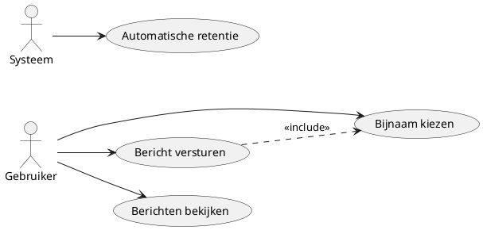

# Functioneel Ontwerp — deskchat live

**Project:** deskchat live  
**Versie:** 2.1  
**Datum:** 2025-09-09  
**Auteur:** Senne Visser  
**Website:** https://deskchat.live

---

## Inhoudsopgave
1. Voorwoord
2. Samenvatting
3. Huidige situatie (Hoe communiceren systemen)  
   3.1 Wat er nu is  
   3.2 Wat er ontbreekt
4. Gewenste situatie (Hoe moeten systemen communiceren)  
   4.1 Wat het systeem moet kunnen (MoSCoW)  
   4.2 Hoe gebruikers het systeem gebruiken  
   4.3 Wat voor onderdelen er komen
   4.4 Use-cases
   4.5 Use-case diagram
5. Gevolgen en impact  
   5.1 Voor gebruikers  
   5.2 Voor beheer  
   5.3 Kosten  
   5.4 Planning (tot vrijdag 19 september 2025, 23:29)
6. Acceptatiecriteria

---

<!-- 
Kijk dit document houd zich al een stuk beter aan de inhoudsopgave van het boek. 
Kopjes zijn net anders genoemd, maar dat is niet erg.
Ik mis nog wel een aantal zaken. Namelijk: 
- Informatieverwerking onder gewenste situatie
    - de use-cases ✅
    - use-case tabellen ✅
    - use-case diagram(men) ✅
-->

## 1. Voorwoord
Dit document beschrijft **wat** deskchat live doet en waarom. Het systeem bestaat uit een bewegende achtergrond op de computer die live chatberichten toont, en een klein programma waarmee je zelf berichten kunt versturen. Het is bedoeld voor mensen die graag een sociale, interactieve achtergrond willen tijdens het werken.

---

## 2. Samenvatting
deskchat live is een chatprogramma dat bestaat uit twee delen:

**De achtergrond**: Een bewegende achtergrond voor je computer (gemaakt met Wallpaper Engine) waar je live berichten van andere gebruikers ziet verschijnen. Je kunt hier alleen kijken, niet typen.

**Het chatprogramma**: Een klein programma dat onzichtbaar op de achtergrond draait. Via een icoon onderin je scherm kun je chatberichten typen en versturen.

**Gebruiksgemak**: Geen ingewikkelde accounts aanmaken - je kiest gewoon een bijnaam en kunt meteen chatten. Berichten zijn openbaar en iedereen kan meepraten in één grote chatruimte.

**Veiligheid**: Het systeem houdt geen persoonlijke gegevens bij en beschermt tegen spam door limieten in te stellen op hoeveel berichten je kunt versturen.

---

## 3. Huidige situatie
### 3.1 Wat er nu is
- Er bestaan websites (deskchat.live) maar er draait nog geen chatsysteem
- Mensen kunnen Wallpaper Engine installeren voor bewegende achtergronden
- Er is webhosting beschikbaar om het systeem te laten draaien

### 3.2 Wat er ontbreekt
- Een manier om live berichten te delen tussen gebruikers
- Een programma waarmee mensen berichten kunnen typen
- Een systeem dat berichten opslaat en doorgeeft
- Bescherming tegen spam en ongepast taalgebruik

---

## 4. Gewenste situatie

<!-- Laat een Use case diagram (alleen must haves) zien om een duidelijk overzicht te maken wat het systeem gaat doen. Leg vervolgens het plaatje in de tekst ook nog uit -->

### 4.1 Wat het systeem moet kunnen (MoSCoW)

**Must have**
- Achtergrond toont nieuwe berichten van andere gebruikers
- Gebruikers kunnen berichten typen en versturen via een klein programma <!-- Klein programma is niet relevant om te noemen, daarmee maak je er namelijk een gecombineerde use-case van. het deel 'klein programma' is een niet-functionele requirement. -->
- Berichten mogen niet te lang zijn (maximaal 280 tekens, zoals Twitter) <!-- Haakjes wegwerken en het direcht beschrijven, Twitter noemen is niet nodig -->
- Gebruikers kunnen een bijnaam kiezen (geen echte naam vereist) <!-- Haakjes zijn niet nodig -->
- Systeem blokkeert scheldwoorden en ongepaste taal <!-- Is dit echt een must have? het functioneert zonder dit ook. Het is niet wenselijk, maar functioneert wel -->
- Bescherming tegen spam (niet te veel berichten per persoon) <!-- Idem, Echt een Must have? -->
- Berichten worden automatisch verwijderd na een tijdje (maximaal 90 dagen) <!-- Idem, Echt een Must have? -->

**Could have** 
- Berichten laden snel en de achtergrond gebruikt weinig computer-kracht
- Duidelijke foutmeldingen als er iets mis gaat
- Het programma stopt met werken als je computer vergrendeld is (bespaart internetverkeer)
- Informatie over privacy op de website

**Won't have, mby later**
- **Meerdere chatruimtes**: bijvoorbeeld apart voor verschillende onderwerpen
- **Plaatjes delen**: kleine animaties (GIFs) kunnen delen via links
- Eenvoudige smileys in berichten

**Komt er niet (te ingewikkeld voor nu)**
- Bestanden uploaden
- Berichten die alleen jij kunt lezen
- Moderatoren die berichten kunnen verwijderen

---

### 4.2 Hoe gebruikers het systeem gebruiken
<!-- Laat zien met een activity diagram -->
**Een gewone gebruiker wil chatten:**
1. Installeert Wallpaper Engine en zet de deskchat live achtergrond aan
2. Downloadt het kleine chatprogramma en start het op
3. Kiest een bijnaam (bijvoorbeeld "Alex" of "ChatLover")
4. Typt een bericht en drukt op verzenden
5. Ziet het bericht verschijnen op de achtergrond, samen met berichten van anderen
6. Kan altijd nieuwe berichten typen via het icoon onderin het scherm

<!-- De onderstaande dingen kunnen mooi in usecase tabellen dan weet je ook meteen bij welke usecase deze hoort -->

**Wat er gebeurt als er problemen zijn:** 
- Te lang bericht → gebruiker krijgt melding "Bericht te lang, maximaal 280 tekens"
- Scheldwoord gebruikt → gebruiker krijgt melding "Bericht bevat ongepaste taal"
- Te veel berichten gestuurd → gebruiker krijgt melding "Wacht even voordat je weer een bericht stuurt"
- Geen internetverbinding → programma probeert het later opnieuw

**Wat gebruikers zien op hun achtergrond:**
- Nieuwe berichten verschijnen automatisch (iedere paar seconden wordt er gekeken)
- Oude berichten verdwijnen van het scherm (alleen de laatste 100 berichten blijven zichtbaar)
- Als de computer vergrendeld is, stopt de achtergrond met laden van nieuwe berichten

---

### 4.3 Wat voor onderdelen er komen <!-- Soortvan Applicaties hoofdstuk -->

**De bewegende achtergrond:**
- Toont alleen berichten (je kunt er niet in typen)
- Ververst automatisch elke paar seconden
- Toont maximaal 100 berichten tegelijk
- Werkt alleen als je computer niet vergrendeld is

**Het chatprogramma:**
- Klein programma dat onzichtbaar op de achtergrond draait
- Icoon onderin je scherm (bij de klok)
- Simpel venster om berichten te typen
- Toont foutmeldingen als er iets mis gaat
- Onthoud je bijnaam zodat je die niet steeds opnieuw hoeft in te voeren

**Het systeem achter de schermen:**
- Ontvangt berichten van gebruikers
- Controleert of berichten niet te lang zijn
- Blokkeert scheldwoorden
- Zorgt dat gebruikers niet te veel berichten versturen
- Slaat berichten op en deelt ze met alle gebruikers
- Verwijdert oude berichten automatisch

---

### 4.4 Use-cases

Onderstaande use-cases beschrijven de primaire (must have) interacties.

#### Overzicht
| ID  | Naam | Korte beschrijving |
|-----|------|--------------------|
| UC1 | Bijnaam kiezen | Gebruiker kiest (en eventueel wijzigt) een bijnaam vóór het verzenden van berichten. |
| UC2 | Bericht versturen | Gebruiker verstuurt een nieuw chatbericht dat wordt gevalideerd en verspreid. |
| UC3 | Berichten bekijken | Wallpaper / client haalt periodiek nieuwste berichten op en toont max 100. |
| UC4 | Automatische retentie | Systeem verwijdert berichten ouder dan de ingestelde bewaartermijn (max 90 dagen). |

#### UC1 — Bijnaam kiezen
| Veld | Waarde |
|------|--------|
| Versie | 1.0 |
| Actor | Gebruiker |
| Preconditie | Client is gestart; netwerk beschikbaar. |
| Scenario | 1. Gebruiker opent chatvenster. 2. Systeem toont invoerveld voor bijnaam (prefill laatste keuze indien aanwezig). 3. Gebruiker voert bijnaam (1–32 tekens, geen alleen spaties) in. 4. Gebruiker bevestigt keuze. 5. Systeem slaat bijnaam lokaal op (niet op server) en markeert clientstatus 'klaar om te posten'. |
| Uitzonderingen | a. Ongeldige invoer (te lang / leeg / alleen spaties) → Systeem toont foutmelding en blijft in stap 3. b. Netwerk niet beschikbaar (geen effect; bijnaam kan alsnog lokaal opgeslagen worden). |
| Niet-functionele eisen | Validatie gebeurt client-side zonder merkbare vertraging (<100ms). |
| Postconditie | Geldige bijnaam staat klaar voor gebruik bij UC2. |

#### UC2 — Bericht versturen
| Veld | Waarde |
|------|--------|
| Versie | 1.0 |
| Actor | Gebruiker |
| Preconditie | Geldige bijnaam gekozen (UC1); client heeft device-id; API online. |
| Scenario | 1. Gebruiker typt bericht (1–280 tekens). 2. Gebruiker klikt Verzenden. 3. Client voegt metadata toe (device-id, bijnaam) en verstuurt POST naar API. 4. Server valideert lengte en karakterset. 5. Server voert profanity controle uit. 6. Server controleert rate limit (per device/ip). 7. Server slaat bericht op en retourneert 201 + payload (id, timestamp, nickname, text). 8. Client toont succes (optioneel leeg veld). |
| Uitzonderingen | a. Lengte ongeldig → 422 validation_failed (client toont melding). b. Profanity gedetecteerd → 422 profanity_blocked (melding). c. Rate limit overschreden → 429 rate_limited + retry_after (client toont wachttijd). d. Ontbrekende / corrupte device-id → 400 missing_device_id (client genereert nieuwe id en herhaalt vanaf stap 1). e. Netwerkfout / timeout → Client toont tijdelijke fout en biedt opnieuw verzenden. f. Server 5xx → Client toont generieke fout, geen retry-spam (backoff). |
| Niet-functionele eisen | Responstijd API p95 < 500ms bij normaal gebruik; foutmeldingen zijn duidelijke NL tekst; geen PII verstuurd. |
| Postconditie | Bericht staat opgeslagen en wordt beschikbaar voor ophalen (UC3). |

#### UC3 — Berichten bekijken
| Veld | Waarde |
|------|--------|
| Versie | 1.0 |
| Actor | Wallpaper / Kijkende gebruiker |
| Preconditie | Client draait; API online. |
| Scenario | 1. Wallpaper initieert poll (of fetch) elke 3–5 seconden. 2. Client vraagt berichten (met since-id of timestamp) op. 3. Server retourneert lijst met nieuwste berichten (gesorteerd, max window). 4. Client voegt nieuwe berichten toe aan weergave. 5. Client verwijdert lokaal oudste berichten zodat er max ~100 zichtbaar blijven. 6. Weergave wordt geüpdatet zonder hapering. |
| Uitzonderingen | a. Geen nieuwe berichten → Client wacht volgende poll (stil). b. Netwerkfout → Client toont niets extra en probeert later opnieuw (exponentiële backoff max X). c. API error 5xx → Log lokaal, volgende poll doorgaan. d. Scherm vergrendeld / tab hidden → Polling gepauzeerd (energiespaar). |
| Niet-functionele eisen | p95 fetch < 400ms; CPU gebruik wallpaper minimaal (<5%); geen memory leak (stabiel aantal DOM-nodes). |
| Postconditie | Gebruiker heeft recent overzicht; interne state bevat laatste id/timestamp. |

#### UC4 — Automatische retentie
| Veld | Waarde |
|------|--------|
| Versie | 1.0 |
| Actor | Systeem (scheduler / onderhoudsproces) |
| Preconditie | Scheduler actief; database bereikbaar. |
| Scenario | 1. Scheduler start dagelijks (of elk uur). 2. Proces selecteert berichten ouder dan X dagen (≤90). 3. Verwijdert geselecteerde berichten permanent. 4. Logt aantallen verwijderde records. 5. (Optioneel) Optimaliseert indices / vacuüm. |
| Uitzonderingen | a. Database niet bereikbaar → Log fout, retry volgende run. b. Verwijderactie gedeeltelijk gelukt → Log aantallen; geen rollback nodig als per batch. c. Config fout (negatieve leeftijd) → Proces stopt en logt kritieke fout. |
| Niet-functionele eisen | Run duurt < 1 minuut bij verwacht volume; geen waarneembare impact op posting latency. |
| Postconditie | Alleen recente berichten blijven beschikbaar (privacy & performance). |

Referentie naar Acceptatiecriteria: UC2 & UC3 dekken real-time gedrag; UC2 uitzonderingen koppelen direct aan foutcodes; UC4 aan retentie; UC1 aan voorwaarde voor posten.

---

### 4.5 Use-case diagram

---

## 5. Gevolgen en impact
### 5.1 Voor gebruikers
- **Voordelen:** Leuke, interactieve achtergrond tijdens het werken; geen ingewikkelde accounts
- **Nadelen:** Alleen Windows computers; vereist Wallpaper Engine (kost een paar euro)
- **Privacy:** Geen persoonlijke gegevens opgeslagen; berichten zijn openbaar voor iedereen
- **Gebruik:** Geschikt voor mensen die van sociale interactie houden tijdens werken

### 5.2 Voor beheer
- **Onderhoud:** Minimaal; systeem draait grotendeels automatisch
- **Moderatie:** Automatische filter voor scheldwoorden; handmatige moderatie niet vereist
- **Kosten:** Gebruikt bestaande webhosting; geen extra kosten
- **Schaalbaarheid:** Kan groeien naar meer gebruikers zonder grote aanpassingen

### 5.3 Kosten
- **Gebruikers:** Wallpaper Engine (eenmalig ~€4), verder gratis
- **Ontwikkeling:** Geen extra kosten (gebruikt bestaande hosting)
- **Onderhoud:** Minimale tijd voor monitoring en updates en hostingkosten voor api en welcome page (~€ 4 per maand)

---

## 6. Planning (tot vrijdag 19 september 2025, 23:29)
- 9–10 sep: Backend MVP afronden (berichten GET/POST, validatie, woordfilter, throttling, retentie). <!-- Dit is al klaar dus? -->
- 11–12 sep: Tray-app MVP (verzenden/ontvangen, foutmeldingen, device-id, tray-icoon). <!-- Hiermee ben je al begonnen? -->
- 13 sep: Wallpaper (polling, DOM-cap 100, pauze bij vergrendeling/hidden). <!-- Que? -->
- 14-15 sep: Integratie en E2E tests (happy path + fouten, privacytekst 1e versie). 
- 16 sep: Hosting/deploy, CORS check, scheduler, healthcheck, Feedbackronde, finetuning UX/teksten.
- 17 sep: bufferdag (bugfixes, kleine verbeteringen).
- 18 sep: Documentatie (korte handleiding, readme, privacy-notitie).
- 19 sep: Buffer & oplevering (demo, korte handleiding, definitieve privacy-notitie) vóór 23:29.

---

## 7. Acceptatiecriteria <!-- Dit zijn een soort testcases, gebruik die in je testrapport -->
- Wallpaper toont nieuwe berichten binnen ~10 seconden; maximaal ~30 zichtbaar.
- Tray-app kan bericht (1–280 tekens) met bijnaam versturen; duidelijke foutmelding bij: te lang, woordfilter, rate limit, ontbrekende device-id.
- API responses conform: 201 bij succes; 400 missing_device_id; 422 validation_failed/profanity_blocked; 429 rate_limited met retry_after.
- Geen accounts; geen persoonsgegevens opgeslagen; alleen anonieme device-id en ip_hmac (hash van IP) voor misbruikpreventie.
- Berichten ouder dan max 90 dagen worden automatisch verwijderd.
- Privacy-notitie in gewone taal is beschikbaar op de site.
