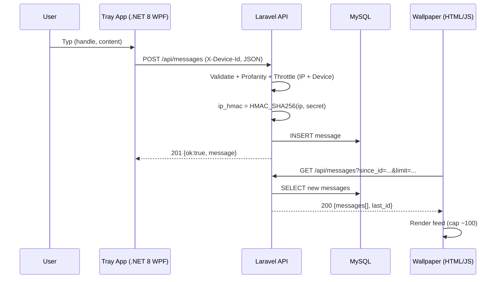
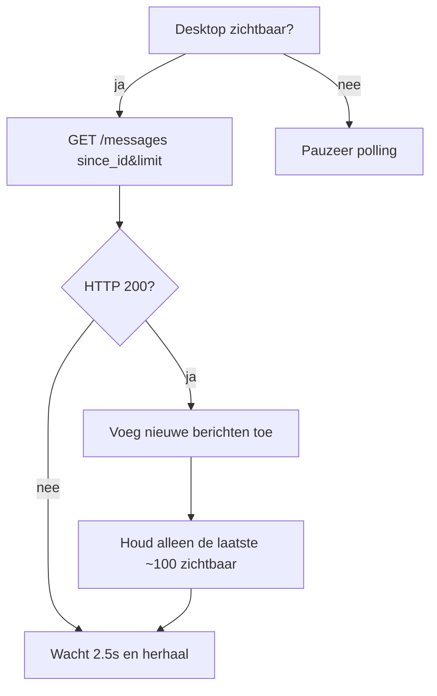
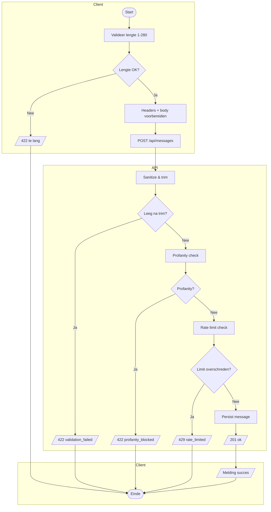
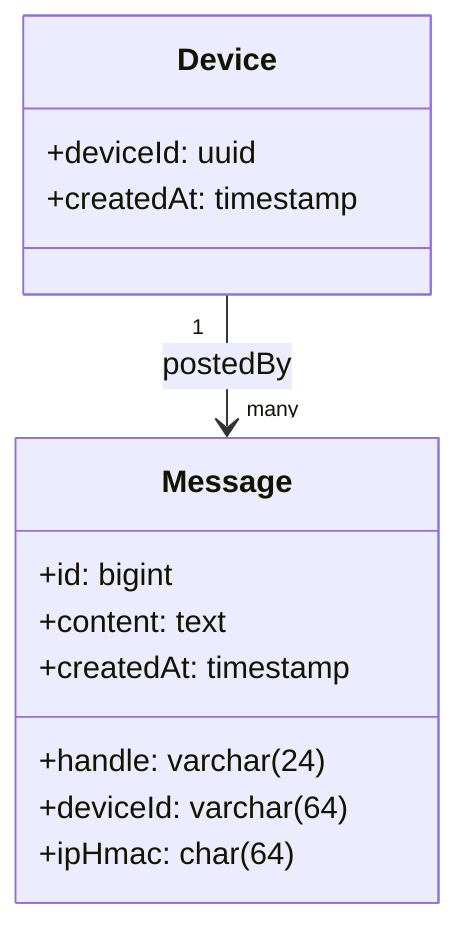

# Technisch Ontwerp — deskchat live

**Project:** deskchat live  
**Versie:** 1.4 (boek-conform)  
**Datum:** 2025-09-16  
**Opdrachtgever:** Sven Imholz  
**Auteur:** Senne Visser  
**Website:** https://deskchat.live  
**API:** https://api.deskchat.live

---

## Voorblad
- **Titel:** Technisch Ontwerp — deskchat live
- **Versie/Datum:** 1.4 — 2025-09-16
- **Opdrachtgever:** Sven Imholz
- **Auteur:** Senne Visser
- **Distributie:** intern projectonderwijs
- **Revisiehistorie:**
  | Versie | Datum | Wijziging |
  |---|---|---|
  | 1.3 | 2025-09-09 | Eerste volledige TO |
  | 1.4 | 2025-09-16 | Herordend volgens boek; UI-interfaces uitgewerkt; schema’s gegroepeerd |

---

## Voorwoord
Dit document beschrijft **hoe** deskchat live technisch wordt gerealiseerd. Deskchat live bestaat uit:
- een **Windows-achtergrond** (Wallpaper Engine) die live berichten **weergeeft** (read-only),
- een lichte **tray-app** waarmee gebruikers berichten **versturen**,
- een **Laravel API** die berichten **valideert, filtert, begrenst** en **opslaat**.

Het Functioneel Ontwerp (FO) beschrijft **wat** het systeem moet kunnen; dit Technisch Ontwerp beschrijft **hoe** dat wordt bereikt.

---

## Inhoudsopgave
*(automatisch gegenereerd bij export)*

---

## Samenvatting
- **Doel:** een laagdrempelige, privacy-vriendelijke publieke chat tonen als bureaubladachtergrond.
- **Architectuur (MVP):**
    - **Wallpaper (HTML/JS):** haalt elke ±2,5–5 s berichten op, toont max. 100 recente items, pauzeert bij vergrendeld scherm.
    - **Tray-app (.NET 8 WPF):** verstuurt berichten via `POST /api/messages`, leest mee via `GET /api/messages`, gebruikt header **`X-Device-Id`** (UUID).
    - **API (Laravel 11, PHP 8.2/8.3, MySQL 8):** validatie, woordenfilter, **rate limiting** per device en per IP-hash, opslag met **`ip_hmac`** (geen ruwe IP’s).
- **Hosting:** Hostinger (LiteSpeed/Apache), HTTPS via Let’s Encrypt, cron voor retentie.
- **Scope MVP:** één publieke room, tekst-only, geen accounts. Optioneel later: meerdere rooms, GIF-links.

---

## Plan van aanpak

### Op te leveren producten
- **API** op `https://api.deskchat.live` (endpoints: `GET /api/messages`, `POST /api/messages`, `GET /api/health`).
- **Tray-app** (Windows, .NET 8 WPF; release build).
- **Wallpaper** (`index.html` voor Wallpaper Engine).
- **Documentatie:** korte handleiding, privacy-notitie, FO/TO, testrapport.

### Planning
- **9–10 sep:** Basis van de server afronden: berichten ontvangen/terugsturen, invoer controleren, scheldwoorden blokkeren, te snel posten afremmen, oude berichten automatisch verwijderen.
- **11–12 sep:** Tray-app bouwen: berichten sturen/zien, duidelijke foutmeldingen, apparaat-ID opslaan, tray-icoon.
- **13 sep:** Achtergrond instellen: elke paar seconden ophalen, max. 100 tonen, pauze bij vergrendeling/hidden.
- **14–15 sep:** Alles koppelen en volledig testen (zowel goede als fout-scenario’s). Eerste versie van de privacytekst.
- **16 sep:** Online zetten op de hosting; CORS controleren; scheduler/healthcheck activeren; feedback verwerken en UX-/teksten bijschaven.
- **17 sep:** Bufferdag: bugfixes en kleine verbeteringen.
- **18 sep:** Documentatie afronden: handleiding, README en privacy-notitie.
- **19 sep (vóór 23:29):** Demo en oplevering.

---

## Interfaces
> In dit hoofdstuk staan de schermen/vensters: doel, acties, voorwaarden, grootte en typografie.

### 1) Wallpaper-weergave (read-only)
- **Doel:** recente chatberichten zichtbaar maken op de achtergrond.
- **Acties/gedrag:** haalt elke 2,5–5 s nieuwe berichten op; toont maximaal **100** recente; pauzeert bij vergrendeld/verborgen scherm.
- **Voorwaarden vóór openen:** internetverbinding; API bereikbaar.
- **Grootte/positie:** full-screen via Wallpaper Engine; niet-interactief.
- **Typografie/stijl:** systeemlettertype; minimaal 12 pt; hoog contrast (donkere achtergrond, lichte tekst).

### 2) Tray-venster “Bericht sturen”
- **Doel:** snel een bericht plaatsen.
- **Elementen & acties:** tekstinvoer (1–280 tekens) met teller; **Versturen** valideert en post; bij succes leeg veld; duidelijke NL-fouten bij 422/429/5xx.
- **Voorwaarden vóór openen:** geldige bijnaam ingesteld; internetverbinding.
- **Grootte/positie:** ca. **360×220 px**; modaal; Esc sluit; sluiten = minimaliseren naar tray.
- **Typografie/stijl:** systeemlettertype; statusregel onder invoerveld.

### 3) Tray-venster “Instellingen”
- **Doel:** lokale bijnaam en autostart instellen.
- **Elementen & acties:** invoer **Bijnaam** (1–32 tekens; geen alleen spaties); **Opslaan**; optie **Starten met Windows**.
- **Voorwaarden:** geen.
- **Grootte/positie:** ca. **360×260 px**, via tray-menu.

### 4) Foutmeldingsdialoog
- **Scenario’s:**
    - **422:** “Bericht is te lang of ongeldig.”
    - **429:** “Te snel achter elkaar. Probeer opnieuw over *x* seconden.”
    - **5xx/timeout:** “Er is een tijdelijke storing. Probeer het later nogmaals.”
- **Actie:** **Sluiten** (Esc of Enter); client hanteert backoff (geen spam).

---

## Ontwikkelomgeving

### Technische infrastructuur
- **Hosting:** Hostinger (LiteSpeed/Apache).
    - Subdomein `api.deskchat.live` → document root: `domains/deskchat.live/public_html/_api/public`.
    - **PHP 8.2/8.3**, **MySQL 8.x**, Composer.
    - **HTTPS** via Let’s Encrypt.
    - **Cron:** `php /home/USER/domains/deskchat.live/public_html/_api/artisan schedule:run` elke minuut (retentie e.d.).
- **CORS:** `GET` open (ook voor wallpaper); `POST` toegestaan voor tray-app; geen credentials.
- **Logging & privacy:** applicatielogs bevatten geen ruwe IP’s; alleen `ip_hmac`. Hosting-accesslogs met IP’s worden in de privacy-notitie genoemd.
- **Lokaal:** Windows 11; optioneel WSL2 Ubuntu 22.04 voor PHP/Composer.
- Branchstrategie:
  - `main`: stabiele productiecode; versie-tags (`vMAJOR.MINOR.PATCH`).
  - `dev`: integratiebranch voor lopend werk; feature-branches `feature/*` via PR naar `dev`.
- Releases:
  - API: semver tags; changelog bijhouden in repo; deploy vanuit tag.
  - Tray-app: semver releases met buildnummer; binaries publiceren in Releases.
- Code review & QA:
  - PR verplicht naar `dev` met checklist (build/test groen).
  - Documentatie en testplan bijwerken bij functionaliteitswijzigingen.
### Schema’s
#### Sequentiediagram — posten & tonen


#### Activiteitendiagram — wallpaper polling


#### Activiteitendiagram — UC2 bericht versturen


#### Klassendiagram (conceptueel)


### Database-ontwerp
**Tabel `messages`**
```sql
CREATE TABLE messages (
  id BIGINT UNSIGNED AUTO_INCREMENT PRIMARY KEY,
  handle VARCHAR(24) NULL,
  content TEXT NOT NULL,
  device_id VARCHAR(64) NULL,
  ip_hmac CHAR(64) NOT NULL,
  created_at TIMESTAMP NULL,
  updated_at TIMESTAMP NULL,
  INDEX idx_created_id (created_at, id),
  INDEX idx_device (device_id),
  INDEX idx_ip_hmac (ip_hmac)
);
```
- **Retentie:** berichten ouder dan **90 dagen** worden automatisch verwijderd (cron).
- **Optioneel (rooms):** `room VARCHAR(32) NOT NULL DEFAULT 'global'` + index `(room, created_at, id)`.

### Ontwikkeltools
- **IDE’s:** PhpStorm (API), Visual Studio 2022 / Rider (tray-app).
- **CLI:** Composer, PHP CLI, .NET SDK, Git.
- **Testen:** PHPUnit voor API; handmatige E2E voor tray/wallpaper.
- **Lint/format:** PHP-CS-Fixer, EditorConfig.
- **Diagrammen:** Mermaid (Markdown).

## Beveiliging

### Autorisatie
- Geen gebruikersaccounts in de MVP.
- **POST** vereist **`X-Device-Id`** (UUID). Zonder header → **400**.
- Optioneel later: extra **`X-Client-Key`** per tray-release.

### Ongewenst gebruik van de applicatie
- **Spam/flooding:** rate limits per device en per IP-hash; melding **429** met `retry_after`.
- **Toxic/ongepaste taal:** woordenlijst blokkeert; lijst uitbreidbaar.
- **XSS/HTML:** content is platte tekst; output wordt ge-escaped; geen HTML-rendering.
- **SQL-injectie:** ORM/parameterbinding; geen dynamische stringconcats.
- **DoS:** request-limieten, response-caps; client-backoff.
- **Privacy:** geen ruwe IP’s in applicatie/DB; alleen `ip_hmac`. Hosting-accesslogs met IP’s worden in de privacy-notitie benoemd.

## Beheer

### Back-up
- **Database:** dagelijkse MySQL-backup via hPanel; bewaartermijn 7/30 dagen.
- **Hersteltest:** periodiek test-restore naar een aparte schema/omgeving.
- **Continuïteit:** storingsprocedure in drie stappen (melden → herstellen → evalueren).

### Content
- **Toegestaan:** tekst (UTF-8) 1–280 tekens.
- **Verboden/gefilterd:** kwetsende taal (woordenlijst), scripts/HTML, PII.
- **Retentie:** automatische verwijdering na **max. 90 dagen**.
- **Incident-procedure:** woord toevoegen aan lijst en (indien nodig) ban op device-id/IP-hash.
