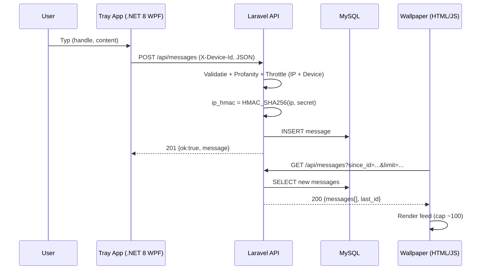
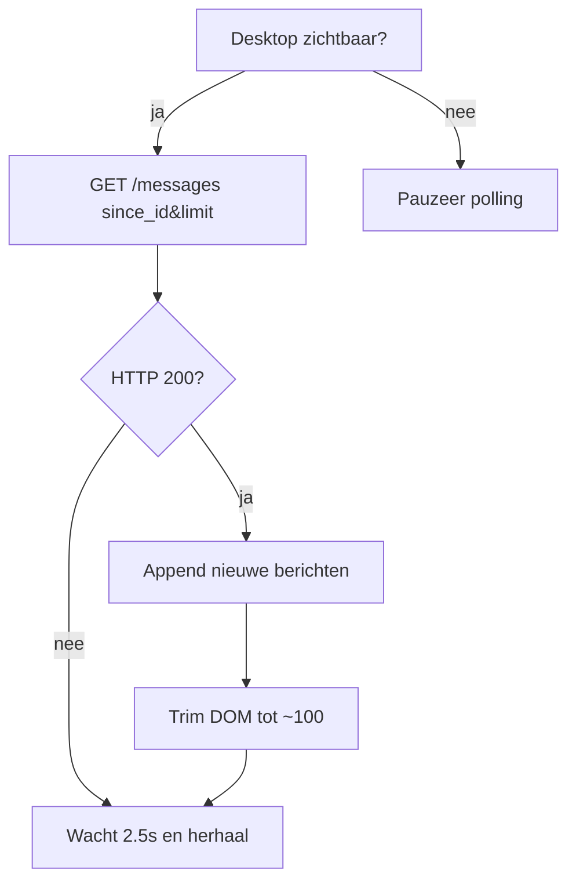

# Technisch Ontwerp — deskchat live

**Project**: deskchat live  
**Versie**: 1.3  
**Datum**: 2025-09-09  
**Auteur**: Senne Visser  
**Website**: https://deskchat.live  
**API**: https://api.deskchat.live

---

## Inhoudsopgave
1. Voorwoord
2. Samenvatting
3. Plan van aanpak
4. Op te leveren producten
5. Planning (tot vrijdag 19 september 2025, 23:29)
6. Interfaces (sequence en activity diagram)
7. Ontwikkelomgeving
8. Technische infrastructuur
9. Schema’s
10. Database-ontwerp
11. Ontwikkeltools
12. Beveiliging
13. Autorisatie
14. Ongewenst gebruik van de applicatie
15. Beheer
16. Back-up
17. Content
18. Niet-functionele eisen (NFR)
19. Acceptatie- en teststrategie
20. Technische eisen
21. Versiebeheer

---

## 1. Voorwoord
Dit Technisch Ontwerp (TO) beschrijft alle technische keuzes en implementatiedetails voor **deskchat live**:
- **Wallpaper Engine** web-wallpaper die live chatberichten toont (**read-only**).
- **Windows tray-app** (C#/.NET 8 **WPF**) voor invoer en het bekijken van berichten.
- **Laravel API** (Hostinger web hosting) voor validatie, filtering, throttling en opslag.  
  Privacy-by-design is uitgangspunt (geen ruwe IP-opslag; alleen een HMAC van het IP-adres).

---

## 2. Samenvatting
**Architectuur (MVP)**
- **Wallpaper (HTML+JS):** Pollt `GET /api/messages?since_id=&limit=` elke ±2,5 s; rendert laatste ~100 berichten; pauzeert polling wanneer het bureaublad niet zichtbaar is (`document.hidden`).
- **Tray-app (C#/.NET 8 WPF):** Plaatst berichten via `POST /api/messages`, leest feed via `GET`, toont foutmeldingen (422/429). Stuurt **`X-Device-Id: <UUID>`** mee.
- **Laravel API (PHP 8.2/8.3):** Validatie, **profanityfilter**, **rate limiting** per-IP en per-device, opslag met **`ip_hmac`** (HMAC van IP m.b.v. server-secret; geen raw IP).

**Tech stack (kern)**
- **Backend:** PHP 8.2/8.3, **Laravel 11+**, MySQL 8.x, Composer
- **Client:** **.NET 8 (C#) WPF** (tray), **HTML + JavaScript** (wallpaper)
- **Hosting:** Hostinger web hosting (LiteSpeed/Apache, `.htaccess`), Let’s Encrypt TLS
- **Cache/Rate limiting:** Laravel **database cache** (`cache:table`; geen Redis vereist op shared)
- **Broncode:** Git (branches `main`/`dev`), semver voor tray-app releases

**Scope / Roadmap**
- **MVP:** Eén publieke room (`global`), tekst-only, geen accounts.
- **Could-have (in sync met FO/Projectplan):**
    - **Meerdere chatrooms** (parameter `room`, default `global`).
    - **Lichtgewicht GIF-embeds** (Tenor/gelinkte `.gif`) client-side; geen uploads/hosting.

---

## 3. Plan van aanpak
1. **Repos opzetten:** `api` (Laravel), `tray` (WPF), `wallpaper` (HTML).
2. **API-contract** vastleggen; routes stubs + validatie + filters.
3. **DB-migraties** + database cache voor rate limiting; `.env` en CORS configureren.
4. **Tray-app MVP:** UI, device-id, POST/GET, error UI, tray-icoon, hide-to-tray.
5. **Wallpaper:** minimal `index.html` (polling, DOM-cap, pause bij `document.hidden`).
6. **Hostinger deploy:** subdomein, SSL, artisan optimize, cron scheduler.
7. **E2E & performance:** acceptatietests, latency/CPU-metingen, retentiejob.
8. **Documentatie & beheer:** README, privacy-notitie, beheercheatsheet.

---

## 4. Op te leveren producten
- Live **API** op `https://api.deskchat.live` (GET/POST).
- **Tray-app** (Release build, single-file publish optioneel).
- **Wallpaper** `index.html` (importeerbaar in Wallpaper Engine).
- Documentatie: README, FO/TO/Projectplan, privacy-notitie, testrapport.

---

## 5. Planning (tot vrijdag 19 september 2025, 23:29)
| Fase | Periode (2025) | Deliverables |
|---|---|---|
| Analyse & ontwerp | 9 sep | FO/TO updates, planning en acceptatiecriteria |
| Backend MVP | 9–10 sep | GET/POST, validatie, throttling (IP HMAC + device), CORS, retentiejob |
| Tray-app MVP | 11–12 sep | WPF build (send/receive, error UI, tray-icoon, device-id) |
| Wallpaper | 13 sep | index.html (polling, DOM-cap 100, pause bij hidden) |
| Integratie & test | 14–15 sep | E2E, performance sanity, privacytekst v1 |
| Deploy + feedback | 16 sep | Hostinger deploy, SSL, scheduler, healthcheck; feedbackronde, UX-finetuning |
| Buffertijd | 17 sep | Bugfixes, kleine verbeteringen |
| Documentatie | 18 sep | Korte handleiding, README, privacy-notitie |
| Oplevering | 19 sep | Demo, handleiding, privacy-notitie (voor 23:29) |

---

## 6. Interfaces (sequence en activity diagram)

### 6.1 Sequence — Posten & Tonen


### 6.2 Activity — Wallpaper Polling


---

## 7. Ontwikkelomgeving
- **Lokaal:** Windows 11; optioneel WSL2 Ubuntu 22.04 voor PHP/Composer.
- **API lokaal:** PHP 8.2/8.3, Composer, Laravel 11+, MySQL/SQLite; `php artisan serve`.
- **Tray lokaal:** .NET 8 SDK, WPF, Visual Studio 2022 / JetBrains Rider.
- **Wallpaper lokaal:** Browser-test + Wallpaper Engine Editor import.
- **Versiebeheer:** Git met `main`/`dev`, PR-flow.

---

## 8. Technische infrastructuur
- **Hostinger web hosting**
    - Subdomein `api.deskchat.live` → document root: `domains/deskchat.live/public_html/_api/public`
    - SSL/HTTPS (Let’s Encrypt) op `deskchat.live` en `api.deskchat.live`
    - PHP 8.2/8.3, MySQL 8.x, LiteSpeed/Apache (`.htaccess`)
    - **Cron:** `php /home/USER/domains/deskchat.live/public_html/_api/artisan schedule:run` elke minuut
- **CORS**
    - `GET` open (evt. `*` voor wallpaper file://), `POST` via tray-app (device-id vereist), `supports_credentials=false`
- **Logging**
    - App-logs: geen raw IP schrijven; **Hostinger** access logs (met IP) vallen onder hosting (vermeld in privacy-notitie).

---

## 9. Schema’s
### 9.1 API (samenvatting)
- `GET /api/messages?since_id=<int>&limit=<1..100>[&room=<slug> (could)]` → `200 {messages:[{id,handle,content,ts}], last_id}`
- `POST /api/messages` (Headers: `Content-Type: application/json`, `X-Device-Id`)
    - Body: `{"handle":"Senne","content":"hallo"[, "room":"global" (could)]}`
    - Antwoord: `201 {ok:true,message}` · `400 {missing_device_id}` · `422 {validation|profanity_blocked}` · `429 {rate_limited,retry_after}`

### 9.2 Clientconfig
- **Tray-app:** Base URL `https://api.deskchat.live`, persistente UUID als `device_id`
- **Wallpaper:** Base URL `https://api.deskchat.live`, poll-interval 2500 ms, cap 100, pause bij `document.hidden`, `pointer-events:none`

---

## 10. Database-ontwerp
**Tabel: `messages`**
```sql
CREATE TABLE messages (
  id BIGINT UNSIGNED AUTO_INCREMENT PRIMARY KEY,
  handle VARCHAR(24) NULL,
  content TEXT NOT NULL,
  device_id VARCHAR(64) NULL,
  ip_hmac CHAR(64) NOT NULL,
  created_at TIMESTAMP NULL,
  updated_at TIMESTAMP NULL,
  INDEX idx_created_id (created_at, id),
  INDEX idx_device (device_id),
  INDEX idx_ip_hmac (ip_hmac)
);
```
- **Retentie**: purge records ouder dan **90 dagen** (cron).
- **Could-have (rooms)**: kolom `room VARCHAR(32) NOT NULL DEFAULT 'global'`, index `idx_room_created (room, created_at, id)`.

---

## 11. Ontwikkeltools
- **IDE’s**: PhpStorm (API), Visual Studio 2022 / Rider (tray)
- **CLI**: Composer, PHP CLI, .NET SDK, Git
- **Testing**: PHPUnit (API), eenvoudige handmatige E2E voor client/wallpaper
- **Lint/format**: PHP-CS-Fixer, EditorConfig
- **(Optioneel)**: Postman/Insomnia voor API-calls; Mermaid voor diagrammen

---

## 12. Beveiliging
- **Transport**: TLS (HTTPS) verplicht op beide domeinen
- **Input sanitization**: `strip_tags`, trim, lengte-limieten; profanityfilter server-side
- **Rate limiting**: Laravel `RateLimiter` — per-IP (ephemeral) + per-device (`X-Device-Id`) + global circuit breaker
- **IP-privacy**: **geen raw IP** in DB/app-logs; `ip_hmac = HMAC_SHA256(ip, secret)` wordt opgeslagen
- **CORS**: `GET` open; `POST` alleen via tray-app (device-id vereist)
- **Headers**: `X-Device-Id` verplicht voor `POST` (400 bij ontbreken)
- **XSS/HTML**: content is plain text; clients escapen output; geen HTML renderen
- **DOS/Abuse**: `limit` query, response cap, DOM-cap, backoff bij errors

---

## 13. Autorisatie
- **Geen gebruikersaccounts** (MVP).
- **API POST**: vereist **`X-Device-Id`** (UUID) als anonieme client-ident.
- **(Optioneel later)**: extra **`X-Client-Key`** shared secret voor tray-app builds.
- **Geen admin-endpoints** in MVP; bans via shadow-ban op `device_id`/`ip_hmac` als simpele maatregel.

---

## 14. Ongewenst gebruik van de applicatie
- **Spam**: per-IP & per-device rate limits; profanityfilter; max 280 chars
- **Flooding**: global limiter + server-side `limit` + wallpaper DOM-cap
- **Toxic content**: woordenlijst uitbreidbaar; shadow-ban zonder feedback
- **Link-misbruik**: geen automatische rich-preview behalve **Could-have** (Tenor/GIF); anders plain text

---

## 15. Beheer
- **Deploy**: `composer install --no-dev --optimize-autoloader` → `php artisan migrate --force` → `php artisan config:cache route:cache view:cache`
- **Monitoring licht**: 5xx in Laravel logs; Hostinger status; simpele healthcheck route
- **Rotatie**: Laravel logrotate (hPanel/cron), database retentiejob

---

## 16. Back-up
- **DB**: Dagelijkse MySQL-backup via hPanel; retentie bijv. 7/30 dagen
- **Restore-test**: periodiek test-restore naar aparte schema/omgeving
- **Code**: Git is primaire backup; release artifacts van tray-app bewaren

---

## 17. Content
- **Toegestaan**: tekstberichten (UTF-8), 1–280 chars
- **Verboden**: PII, kwetsende taal (gefilterd), scripts/HTML (gestript)
- **Privacy-notitie**: device-id (anoniem), `ip_hmac` (max 90d), hosting access-logs door Hostinger
- **Could-have media**: alleen **links/embeds** voor GIFs (Tenor/gelinkte `.gif`), geen uploads/hosting

---

## 18. Niet-functionele eisen (NFR)
- Performance: nieuwe berichten zichtbaar op wallpaper binnen ~5 s; API p99 < 300 ms bij normaal gebruik.
- Resourcegebruik: wallpaper JS lichtgewicht; DOM maximaal ~100 items; tray-app idle CPU ~0%.
- Beschikbaarheid: basis 24/7 met shared hosting; healthcheck endpoint aanwezig; eenvoudige fallback bij storingen.
- Privacy: geen raw IP in app/DB/logs; alleen ip_hmac (HMAC van IP) + anonieme device-id; TLS verplicht.
- Veiligheid: server-side sanitization (strip_tags), lengte-limieten, woordenfilter; rate limits per IP-HMAC, per device en globaal.
- Onderhoudbaarheid: simpele config via .env; geen zware externe dependencies.

## 19. Acceptatie- en teststrategie
- Unit/Feature tests (PHPUnit):
  - POST validatie (lengte, leeg na sanitization, ontbrekende device-id)
  - Profanity block
  - Rate limiting (per device)
  - Retentiejob (purge >90d)
  - GET since_id/limit en volgorde (asc) met last_id
- Handmatige E2E:
  - Tray→API→Wallpaper flow (bericht sturen en binnen ~5 s zien)
  - Foutpaden in tray: 422, 429, 400 met duidelijke meldingen
  - CORS check voor wallpaper en website
- Performance sanity: 100 snelle POSTs gespreid, API blijft responsief; wallpaper CPU laag.
- Beheercheck: health endpoint 200; cron/scheduler draait; logs zonder PII.

---

## 20. Technische eisen
- Platformen en versies:
  - PHP 8.2/8.3 met Laravel 11+, MySQL 8.x, .NET 8 (WPF), HTML/JS (wallpaper).
- API-contract (MVP):
  - Endpoints: `GET /api/messages`, `POST /api/messages`, `GET /api/health`.
  - Headers: `Content-Type: application/json`, verplicht `X-Device-Id` bij POST.
  - Antwoorden en foutcodes conform sectie 9.1 (201/400/422/429) met consistente JSON.
- Veiligheid & privacy:
  - TLS verplicht; geen raw IP in app/DB/logs; alleen `ip_hmac` (HMAC met server-secret).
  - Server-side sanitization en profanityfilter verplicht actief.
  - Rate limiting per IP (op basis van ip_hmac), per device, plus globale limiter.
- Clientgedrag:
  - Wallpaper pollt elke ~2.5 s; pauzeert bij `document.hidden`; cap ~100 DOM-items.
  - Tray-app bewaart persistente UUID als device-id; toont duidelijke foutmeldingen.
- Dataretentie & beheer:
  - Automatische purge van berichten ouder dan 90 dagen (cron/scheduler).
  - Health endpoint beschikbaar en monitorbaar; deploy via Hostinger met cron voor scheduler.
- CORS:
  - `GET` toegestaan voor wallpaper; `POST` toegestaan voor tray-app; geen credentials.

---

## 21. Versiebeheer
- Branchstrategie:
  - `main`: stabiele productiecode; versie-tags (`vMAJOR.MINOR.PATCH`).
  - `dev`: integratiebranch voor lopend werk; feature-branches `feature/*` via PR naar `dev`.
- Releases:
  - API: semver tags; changelog bijhouden in repo; deploy vanuit tag.
  - Tray-app: semver releases met buildnummer; binaries publiceren in Releases.
- Code review & QA:
  - PR verplicht naar `dev` met checklist (build/test groen).
  - Documentatie en testplan bijwerken bij functionaliteitswijzigingen.
